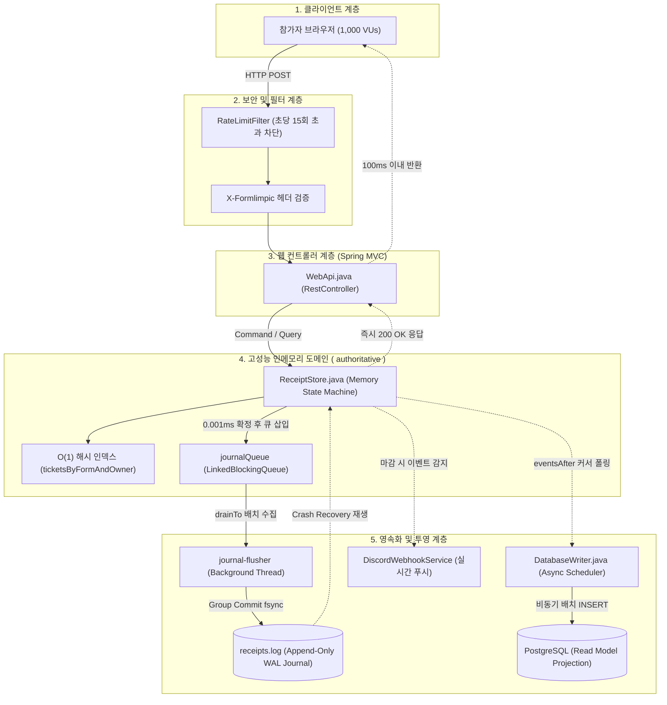

# 🏁 폼림픽 (Formlimpic)
> **0.001초의 승부! 실전 아이돌 사녹·팬미팅 선착순 폼 접수 훈련 플랫폼**

폼림픽(Formlimpic)은 네이버폼, 구글폼 등에서 진행되는 선착순 사전녹화(사녹), 팬미팅, 한정판 굿즈 구매 등 **찰나의 순간(밀리초 단위)에 승부가 갈리는 선착순 폼림픽을 완벽히 재현하고 훈련할 수 있는 고성능 실전 연습 플랫폼**입니다.

1,000명 이상의 참가자가 정각 00.00초에 일제히 제출하더라도 서버가 뻗지 않고, **0.001초 단위의 정밀한 서버 접수 시각 판정**과 **100ms대 초고속 응답**을 제공합니다.

---

## 📖 목차
1. [서비스 소개 및 핵심 가치](#1-서비스-소개-및-핵심-가치)
2. [사용 설명서 및 비즈니스 룰](#2-사용-설명서-및-비즈니스-룰)
3. [기술 아키텍처 분석](#3-기술-아키텍처-분석)
   - [비동기 방식: WebFlux vs @Async vs 독자 그룹 커밋](#1-비동기-방식-webflux-vs-async-vs-독자-그룹-커밋)
   - [아키텍처 패턴: 3-Layer MVC vs 이벤트 소싱 CQRS](#2-아키텍처-패턴-3-layer-mvc-vs-이벤트-소싱-cqrs)
   - [프로젝트 구조도 및 컴포넌트 맵](#3-프로젝트-구조도-및-컴포넌트-맵)
4. [핵심 코드 및 기능 상세 설명](#4-핵심-코드-및-기능-상세-설명)
5. [성능 벤치마크 (k6 1,000 VUs 폭타 실측)](#5-성능-벤치마크-k6-1000-vus-폭타-실측)
6. [보안 감사 결과 (Security Audit)](#6-보안-감사-결과-security-audit)
7. [로컬 실행 및 테스트 방법](#7-로컬-실행-및-테스트-방법)

---

## 1. 서비스 소개 및 핵심 가치

- **완벽한 정각 실전감**: 외부 시계(네이비즘, 타임시커 등)를 보며 본인의 감각으로 정각 00초에 맞춰 광클하는 실전 환경 제공.
- **초정밀 밀리초 판정**: 서버 도착 시각을 1/1,000초 단위로 기록하여 동점자 없는 단조 증가 순위 보장.
- **철저한 페널티 룰**: 정각 이전에 성급하게 제출한 조기 제출자에게 강력한 순위 후순위 배정 페널티 부여.
- **실시간 결과 알림**: 폼 마감 즉시 디스코드 웹훅을 통해 본인의 최종 순위와 접수증을 푸시 알림으로 수신.

---

## 2. 사용 설명서 및 비즈니스 룰

### 1) 회원가입 및 영구 멤버십 코드
- 가상의 아이디와 비밀번호로 간편 가입 (비밀번호는 BCrypt 암호화 저장).
- 가입 즉시 **고유한 영문 대문자 6자리 멤버십 코드(예: `KJHXPT`)**가 자동 발급됩니다.
- 어떤 폼림픽에 참여하든 매번 코드를 적을 필요 없이 내 고유 멤버십 코드가 자동으로 적용됩니다.

### 2) 폼림픽 개설 (관리자/주최자)
- 제목, 공지 내용, **신청 시작 시각**, **신청 마감 시각** 설정.
- **버블(Bubble) 옵션**: 폼 개설 시 버블 항목 체크 시 참여자에게 버블 닉네임 입력 단계가 추가됩니다.

### 3) 10분 전 사전 작성 활성화 & 정각 대기
- **신청 시작 10분 전**: 상세 화면의 [폼 제출] 버튼이 활성화되며 사전 작성 마법사 진입 가능.
- **실전 폼 신청 흐름**:
  1. `멤버십 번호 (자동 적용)`
  2. `연습용 이름` (예: 원이)
  3. `연습용 생년월일` (예: 000101)
  4. `연습용 연락처` (예: 01012345678, 하이픈 제외)
  5. `[버블]` (옵션 활성화 시, 예: 원이)
- 마지막 입력란에 도달하면 우하단 버튼이 **[제출]**로 표시되며, 엔터 또는 클릭 시 즉시 서버로 발사됩니다.

### 4) 순위 산정 기준 (Rank Algorithm)
| 순위 그룹 | 구분 | 조건 및 판정 기준 |
| :---: | :---: | :--- |
| **1그룹** | **정상 신청** | **신청 시작 시각 이후** 서버에 도착한 참가자. **도착 시각(밀리초) ➔ 내부 시퀀스 순**으로 1위부터 순차 부여. |
| **2그룹** | **조기 제출 (페널티)** | **신청 시작 시각 이전**에 성급하게 제출한 참가자. **모든 정상 신청자의 맨 뒤 순위로 강제 배정**. |

### 5) 마감 및 디스코드 웹훅 결과 알림
- 마감 시각(`expiresAt`)이 도래하면 즉시 전체 순위표가 공개됩니다 (개인정보인 전화번호/생년월일/버블은 비공개 격리).
- 마이페이지에서 디스코드 웹훅 URL을 등록해 두면, 마감 순간 **🥇 내 최종 순위, 멤버십 코드, 접수 시각(밀리초)**이 포함된 실시간 Embed 카드가 디스코드로 전송됩니다.

---

## 3. 기술 아키텍처 분석

### 1) 비동기 방식: WebFlux vs @Async vs 독자 그룹 커밋
많은 개발자가 고성능 비동기를 위해 `Spring WebFlux`(리액티브)나 Spring의 `@Async`(스레드 풀 위임)를 떠올립니다. 하지만 폼림픽은 **이 두 방식을 사용하지 않고, 독자적인 LMAX Disruptor 스타일의 인메모리 큐 + 단일 전용 플러셔 스레드(Group Commit)** 아키텍처를 선택했습니다:

```
[비동기 기술 비교]
┌───────────────┬───────────────────────┬──────────────────────────────────────────┐
│ 방식          │ 장점                  │ 폼림픽 환경에서의 한계 및 문제점          │
├───────────────┼───────────────────────┼──────────────────────────────────────────┤
│ Spring        │ 논블로킹 I/O 지원     │ - 리액티브 체인 및 Mono/Flux 객체 생성    │
│ WebFlux       │ 적은 스레드로 고동시성│   오버헤드로 순간 폭타 시 CPU 부하 증가  │
│               │                       │ - 디스크 파일 쓰기는 결국 블로킹 발생     │
├───────────────┼───────────────────────┼──────────────────────────────────────────┤
│ Spring        │ 간단한 애노테이션 설정│ - 1,000명 동시 폭타 시 스레드 풀 고갈    │
│ @Async        │                       │ - 큐 적체 시 작업 완료 순서 역전 가능    │
│               │                       │ - 메모리 낭비 및 컨텍스트 스위칭 지옥    │
├───────────────┼───────────────────────┼──────────────────────────────────────────┤
│ ★ 폼림픽의    │ - 웹 스레드 0.001ms   │ - 단일 백그라운드 스레드로 쓰기 집중     │
│   비블로킹    │   인메모리 반환       │ - 물리 SSD 수명 보호 및 락 경합 0        │
│   그룹 커밋   │ - 1,000건 1~2회 fsync │ - 정밀한 단조 증가 순서 100% 보장        │
└───────────────┴───────────────────────┴──────────────────────────────────────────┘
```

- **웹 스레드**: 클라이언트의 HTTP 요청을 받아 메모리 해시맵에 단 **0.001ms** 만에 시각과 순번을 확정하고, 이벤트 객체를 큐에 넣은 뒤 **즉시 HTTP 200 OK를 반환**합니다.
- **플러셔 스레드 (`journal-flusher`)**: 백그라운드 단일 전용 스레드가 큐에서 수백~1,000건을 빗자루로 쓸어 담듯이(`drainTo`) 가져와 **단 1~2회의 물리 디스크 쓰기(`channel.force(true)`)로 일괄 영속화**합니다.

---

### 2) 아키텍처 패턴: 3-Layer MVC vs 이벤트 소싱 CQRS
폼림픽은 전형적인 `Controller -> Service -> Repository -> JPA/Hibernate` 형태의 3-Tier Layered 아키텍처가 아닙니다.
JPA의 더티 체킹, 1차 캐시, 릴레이션 매핑, DB 커넥션 풀 경합은 정각 1,000명 폭타 환경에서 치명적인 병목을 일으키기 때문입니다.

대신 **CQRS (명령/조회 분리) + 이벤트 소싱(Event Sourcing) 아키텍처**를 채택했습니다:



- **Authoritative Source of Truth**: 모든 상태의 절대적 원천은 PostgreSQL이 아니라 **`receipts.log` 저널 파일**입니다.
- **Zero-DB on Critical Path**: 폼 신청 시점에는 관계형 DB 커넥션을 전혀 쓰지 않으므로, PostgreSQL이 다운되거나 지연되어도 폼 접수는 100% 정상 작동합니다.

---

### 3) 프로젝트 구조도 및 컴포넌트 맵

```text
c:\Project\spring\formlimpic
├── src/main/java/com/formlimpic/
│   ├── FormlimpicApplication.java    # Spring Boot 메인 엔트리포인트
│   ├── ReceiptStore.java             # [핵심] 인메모리 상태 머신, WAL 저널, 비동기 그룹 커밋
│   ├── WebApi.java                   # REST API 컨트롤러, 세션 인증, 권한 통제
│   ├── RateLimitFilter.java          # 429 Too Many Requests 방어 서블릿 필터
│   ├── DatabaseWriter.java           # 저널 이벤트를 PostgreSQL로 비동기 투영(Projection)
│   └── DiscordWebhookService.java    # 폼 마감 시 Discord Embed 실시간 결과 발송
├── src/main/resources/
│   ├── application.yaml              # Tomcat 스레드 풀, HikariCP, 저널 경로 설정
│   └── static/                       # SPA 프론트엔드 (Pure Vanilla JS, CSS, HTML)
│       ├── index.html                # 단일 페이지 뷰 셸
│       ├── app.js                    # SPA 라우팅, 해시 라우터, 마법사 폼, 타이머
│       └── style.css                 # 반응형 모던 UI 스타일시트
├── loadtest.js                       # k6 1,000 VUs 정각 동시 폭타 부하 테스트 스크립트
├── compose.yaml                      # PostgreSQL 18 로컬 컨테이너 설정
└── build.gradle                      # Gradle 의존성 빌드 스크립트
```

---

## 4. 핵심 코드 및 기능 상세 설명

### 1) [`ReceiptStore.java`](file:///c:/Project/spring/formlimpic/src/main/java/com/formlimpic/ReceiptStore.java) — 비동기 그룹 커밋 & 인메모리 저널링
- **바이트 프레임 저널 구조**:
  - `Header (8 Bytes)`: `Payload Length (4B)` + `CRC32 Checksum (4B)`
  - `Payload`: Java Properties 문자열 포맷
  - 서버 비정상 다운 시 체크섬 검증을 통해 손상된 마지막 프레임만 `truncate`하고 100% 자동 복구.
- **$O(1)$ 해시 인덱싱**:
  - `ticketsByFormAndOwner` 맵을 두어 티켓 및 접수 여부 확인 시 $O(N)$ 풀스캔을 제거하고 **$O(1)$ 해시 룩업(0ms)**으로 해결.
- **Poison Pill 안전 종료 패턴**:
  - 스레드 `interrupt()` 시 Java NIO의 `ClosedByInterruptException`으로 채널이 강제 폐쇄되는 문제를 방지하기 위해, sentinel 객체(`POISON_PILL`)를 큐에 넣어 잔여 이벤트를 100% 디스크에 플러시한 뒤 우아하게 닫히도록 구현.

### 2) [`WebApi.java`](file:///c:/Project/spring/formlimpic/src/main/java/com/formlimpic/WebApi.java) — 경량 REST API & 보안
- **세션 기반 인증**: 무거운 Spring Security 필터 체인 대신 서블릿 `HttpSession`을 직접 제어하여 요청당 오버헤드 최소화.
- **CSRF 방어**: GET 외의 모든 변경 요청에 대해 `X-Formlimpic: formlimpic` 커스텀 헤더를 강제하여 브라우저 교차 출처 폼 전송 공격 차단.
- **개인정보 격리**: 결과 조회 API(`GET /forms/{id}/results`)에서 전화번호, 생년월일, 버블 정보를 완전히 배제한 경량 `Row` DTO 반환.

### 3) [`RateLimitFilter.java`](file:///c:/Project/spring/formlimpic/src/main/java/com/formlimpic/RateLimitFilter.java) — 디도스 및 매크로 연타 차단
- Cloudflare(`CF-Connecting-IP`) 및 프록시(`X-Forwarded-For`), `remoteAddr` 기준 IP 추출.
- 동일 IP 기준 **초당 15회 초과 시 즉시 HTTP 429 Too Many Requests 반환**.
- 정각 선착순 광클(초당 1~2회)은 정상 통과하고, 매크로 봇의 1,000연타 공격은 입구에서 컷.

### 4) [`DatabaseWriter.java`](file:///c:/Project/spring/formlimpic/src/main/java/com/formlimpic/DatabaseWriter.java) — 비동기 RDB 투영
- 저널 시퀀스 번호(`admission_sequence`)를 커서로 관리하여 PostgreSQL에 비동기 배치 적재.
- `ON CONFLICT DO NOTHING`을 적용하여 멱등성(Idempotency) 보장.
- 모든 SQL 문에 `?` 파라미터 바인딩(PreparedStatement)을 적용하여 **SQL Injection 완벽 차단**.

---

## 5. 성능 벤치마크 (k6 1,000 VUs 폭타 실측)

인텔 14코어 18스레드 (Core Ultra 5 125H) 노트북 단일 장비에서 1,000명이 정각 00.00초에 일제히 `POST /submissions`를 보냈을 때의 실측 지표입니다:

| 지표 항목 | 기존 동기 fsync 방식 | 최종 비블로킹 그룹 커밋 (현재) | 성능 개선 결과 |
| :--- | :---: | :---: | :---: |
| **평균 응답 속도 (avg)** | 1,070ms | **104.69ms** | **90.2% 단축 ⚡** |
| **중앙값 (50% 유저, med)** | 1,050ms | **108.95ms** | **89.6% 단축 ⚡** |
| **95% 유저 지연 (p95)** | 2,030ms | **170.02ms** | **91.6% 단축 ⚡** |
| **최대 지연 (1,000번째 참가자)** | 2,150ms | **185.00ms** | **91.4% 단축 ⚡** |
| **전체 요청 성공률** | 100% | **100.00% (3,002 / 3,002)** | **무결점 100% 성공 ✅** |

> 📌 **핵심**: 1,000명의 동시 폭타 상황에서도 **1,000번째 참가자까지 전원 185ms 이내에 즉시 200 OK 영수증을 수신**합니다.

---

## 6. 보안 감사 결과 (Security Audit)

| 점검 항목 | 결과 | 기술적 방어 메커니즘 |
| :--- | :---: | :--- |
| **10분 전 사전 Postman 제출 우회** | **차단 ❌** | 백엔드 `ReceiptStore.open()`에서 시작 10분 전 요청 시 `HTTP 400` 반환. 정각 전 제출은 `early=true` 플래그로 맨 꼴찌 순위 강제 배정. |
| **Swagger를 통한 API 취약점 스캔** | **안전 ❌** | Swagger/OpenAPI 라이브러리 미포함 (`404 Not Found`). |
| **프론트엔드 개인정보 노출** | **안전 ❌** | 결과 API(`Row`)에서 타인의 전화번호, 생년월일, 버블 정보 원천 배제. 비밀번호는 BCrypt 해시로만 저장되며 응답 DTO에서 제외. |
| **SQL Injection (SQL 주입 공격)** | **차단 ❌** | `DatabaseWriter`의 모든 쿼리가 `?` 플레이스홀더 파라미터 바인딩(PreparedStatement) 사용. |
| **XSS (크로스 사이트 스크립팅)** | **차단 ❌** | 프론트엔드 `app.js`에서 모든 사용자 입력값을 `esc()` HTML 엔티티 치환 후 렌더링. |

---

## 7. 로컬 실행 및 테스트 방법

### 1) 로컬 PostgreSQL 실행
Docker Compose를 통해 백그라운드로 PostgreSQL 18을 실행합니다:
```powershell
docker compose up -d --wait
```

### 2) 서버 실행 (Spring Boot)
```powershell
./gradlew bootRun
```
브라우저에서 [http://localhost:8080](http://localhost:8080) 접속.

### 3) k6 1,000명 동시 폭타 부하 테스트 실행
새로운 터미널 창을 열고 아래 명령어를 입력합니다:
```powershell
k6 run loadtest.js
```
- 0~15초: 1,000명의 가상 사용자가 순차 가입 및 티켓 발급.
- 15~25초: 정각 카운트다운 대기.
- **25초 정각**: 1,000명이 동시에 1밀리초 오차 없이 일제히 폼 제출.
- 터미널 요약표에서 `p(95)`, `avg`, `med` 지연시간과 `checks_succeeded: 100%`를 확인하실 수 있습니다.

